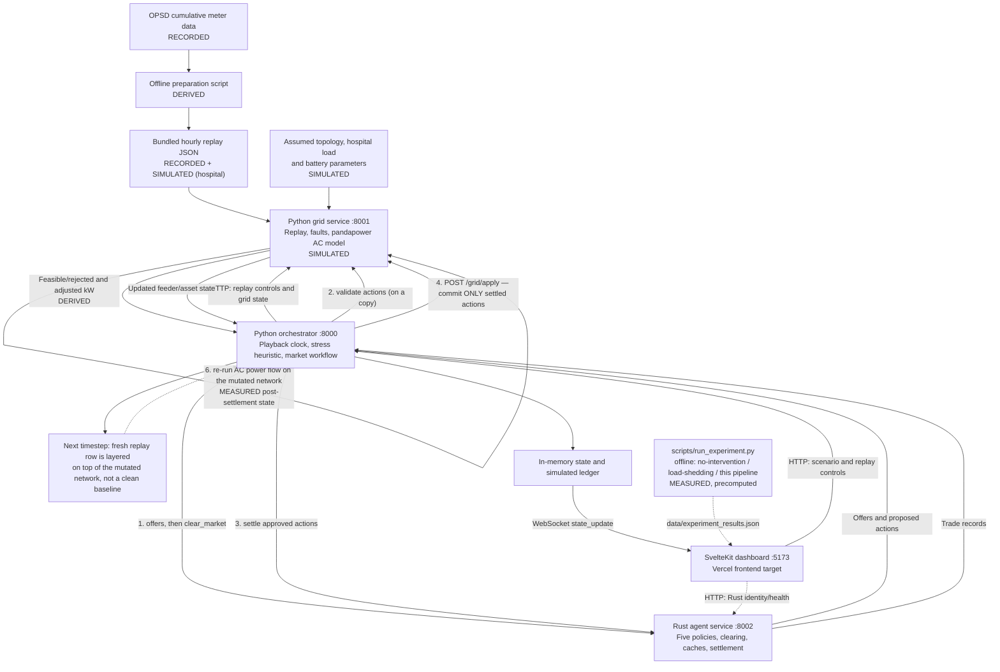

# Microgrid Resilience Exchange

**A Rust-powered flexibility market with Python AC grid validation and public-data replay for a hospital/campus microgrid.**

The demo coordinates flexible demand and battery offers around a modeled critical facility. Its core engineering distinction is the separation of **economic selection in Rust** from **electrical feasibility in Python**, with a SvelteKit dashboard showing the resulting decisions.

**Current scope:** a software simulation and decision-support prototype. Public measurements supply historical profile shapes; the campus, hospital assumptions, fault events and settlements are simulated. Accepted trades are recorded **and** committed into the live simulated grid model (battery SOC debited, load/generation reduced, power flow re-run) — they are not dispatched to real equipment.

[Architecture](#5-system-architecture) · [Run locally](#15-running-the-demo) · [Data provenance](#10-dataset-and-data-provenance) · [API reference](#12-api-and-service-communication) · [Testing](#16-testing) · [Experimental Evaluation](#20-experimental-evaluation) · [Judge demo](#21-hackathon-demo-scenario) · [Limitations](#22-limitations)

## 2. Problem statement

A critical-infrastructure microgrid must balance demand, generation and network limits while preserving essential services. A solar shortfall, rising demand or overloaded feeder can create a supply or delivery constraint even when other assets have flexibility available. A disconnected feeder poses a different problem: an allocation decision alone cannot restore an electrical connection.

Hospital demand cannot be treated as freely interruptible. Unselective shedding ignores the distinction between critical equipment and deferrable consumption. This project explores a more selective approach: identify grid stress, request flexibility from relevant assets, respect their local policies, and check the electrical consequences before recording a settlement.

The hospital/campus network is a representative demonstration model. The repository does not establish clinical operating requirements or validate the system for hospital control.

## 3. Our solution

The Python orchestrator reads the current grid state, flags stressed feeders and requests flexibility. Five Rust policy agents offer reductions or battery discharge. The Rust clearing engine selects offers using cost and a recent-selection penalty. Python applies the proposed actions to a network copy and runs AC power flow. Only feasible actions, with any approved capacity adjustment, are sent back to Rust for settlement. The settled subset is then committed to the **live** network (not a copy) and power flow is re-run, so the next timestep's stress detection sees the effect of this timestep's decisions.

The orchestrator stores returned trades, appends simulated ledger entries and pushes snapshots to the dashboard over WebSocket. It does not manufacture substitute trades when settlement fails, and it does not manufacture a substitute physical effect when the apply step fails.

**Why this split matters:** an economically attractive offer may still violate voltage, asset capacity or network loading constraints. Keeping the validator separate makes that distinction explicit. Rust owns the market state and policies; pandapower supplies the physical modeling tools. No measured speed advantage over Python is claimed.

## 4. Key features

| Implemented capability | What it actually does |
| --- | --- |
| Five asset policies | Hospital, academic, EV, battery and factory/facility offers, scoped to assets connected to the requested feeder |
| Early stress trigger | Orchestrator threshold/trend heuristic; not a trained forecasting model |
| Rust market | Offer caching, greedy cost/fairness selection, stable request ordering and settlement responses |
| AC feasibility checks | Loading, voltage and asset-capacity checks on network copies, with cumulative action validation |
| Critical-load policy | Hospital offers only an assumed 5% flexible share; battery offers respect a reserve floor |
| Public-data replay | 168 hourly intervals derived from OPSD CoSSMic school, office, EV and PV counters |
| Playback controls | Play, pause, one-hour step and restart; automatic stop at the end of the week |
| Provenance | Source link, license, recorded timestamp, scaling metadata and interpolation flags |
| Fault scenarios | Solar drop, demand spike, feeder overload, battery failure, utility outage and line fault |
| Live visualization | Network status, demand/generation totals, battery SOC, activity and simulated ledger |
| Explicit failure path | API errors are surfaced; unavailable settlement creates no orchestrator substitute trades |
| **Closed physical feedback loop** | Settled actions are committed to the live network via `/grid/apply` — battery SOC persists across ticks, load/generation reductions apply immediately, power flow re-runs — verified by a subprocess-level end-to-end test |
| **Measured 3-way comparison** | `scripts/run_experiment.py` runs no-intervention, deterministic load-shedding and the real market pipeline over the identical 168-hour input and reports the honest result, including where the market loses on a metric |

See [limitations](#22-limitations) for the boundaries of these mechanisms.

## 5. System architecture



The orchestrator coordinates the entire sequence; the dashboard does not clear markets itself. Settlement occurs **after** validation, and physical commitment (steps 4–6) occurs **after** settlement and **only** for actions Rust actually settled — a rejected or never-offered action never reaches `/grid/apply`. Solar is an input generator in the physical model, not a sixth Rust policy agent.

**Data provenance key**, used throughout this README: **RECORDED** = taken from the public OPSD/CoSSMic dataset unmodified in shape; **SIMULATED** = a modeled/assumed quantity that does not come from a real meter (hospital load, network topology, battery parameters); **DERIVED** = computed from recorded or simulated inputs by this codebase (scaled profiles, predictions, validation results); **MEASURED** = an empirical result produced by actually running the code on this machine (power-flow outputs, the experiment comparison table, the Rust latency benchmark) rather than assumed or claimed.

An optional [Hono gateway](gateway/app.ts) exists outside this default path. The launcher and Compose configuration do not start it. The Python orchestrator also retains a legacy static HTML page at port 8000; the primary frontend is SvelteKit at port 5173.

## 6. End-to-end data flow

1. **Select an input interval.** The orchestrator reads replay metadata. On subsequent playing cycles it sends a replay tick. Reads alone never advance the cursor; the first sample is processed before advancement.
2. **Build the current network.** The grid service copies its baseline, applies the current scaled profile, reapplies registered faults and attempts AC power flow. It returns asset and feeder state. Recorded input time remains separate from the grid observation timestamp.
3. **Detect stress.** With the current grid API returning no forecasts, the orchestrator derives its own predictions. Non-faulted, non-islanded entries at or above 80% loading are flagged. A positive change between readings gives an estimated time to 100%; otherwise the estimate is unknown. Confidence is a fixed 0.7.
4. **Request flexibility.** The requested amount is `max((loading_percent - 75) * 4, 20)` kW. This is a heuristic, not a power-flow-derived optimum. A ten-tick market cooldown limits repeated requests; recovery below 80% clears it earlier.
5. **Generate and clear offers.** The live client checks Rust service identity. Rust dispatches connected assets to their policies, caches requests/offers and selects non-rejected offers until the requested amount is met or candidates run out.
6. **Validate in order.** The orchestrator sends `{"actions": [...]}` to Python. Each accepted action changes a working copy for the next check; rejected actions do not. Results are matched by `action_id`.
7. **Settle the approved subset.** The orchestrator substitutes `adjusted_kw_amount` when provided, drops infeasible/missing results and sends a bare action array to Rust. An empty or failed settlement produces no replacement trades.
8. **Apply settled actions to the live grid.** The orchestrator sends exactly the settled actions (never the full offered/proposed set) to Python's `POST /grid/apply`. Each action is applied by `asset_id`/`action_id` at most once — a per-process `applied_action_ids` set makes re-sending the same settlement a no-op rather than a double application. Load-reduction/HVAC/EV/production-flex actions reduce the mapped asset's `p_mw` on the **live** network (not a copy); battery discharge additionally debits a persisted MWh energy balance that survives the next tick's baseline rebuild, so a battery that discharges at hour *N* starts hour *N+1* at the lower state of charge. `emergency_reserve` remains a no-op by design. If any action was applied, the grid service re-runs AC power flow once on the mutated network so the returned feeder/asset state reflects the commitment, not the pre-settlement snapshot. An action that failed settlement, or that Rust never selected, is never sent here and therefore never touches physical state — rejected proposals are provably inert.
9. **Publish the result.** Returned trades enter in-memory history and the simulated ledger. A `state_update` snapshot — now reflecting the post-apply grid state — reaches connected dashboards. `GET /grid/applied_actions` exposes the running audit log (which action IDs were applied, current persisted battery energy, and a per-application log) for inspection or debugging; it is informational and outside the shared Rust/Python wire contract.

The loop sleeps two seconds after processing, so one replay hour takes **at least** two wall-clock seconds plus computation and network time. A paused sample is not repeatedly processed after it has been handled. A manual step or scenario control makes a new processing opportunity; an in-flight cycle may finish before a pause takes effect.

**What "next timestep" means physically.** Each tick still starts by copying the network's fixed baseline and layering the current replay row's demand/generation profile on top (unrelated assets are not permanently altered — curtailment does not persist because next hour's profile row is fresh and unrelated to this hour's decision). The one exception is battery energy: because a battery's state of charge is genuinely cumulative, `_seed_battery_energy_from_baseline()` seeds it once from the network's baseline SOC, and every subsequent `/grid/apply` mutates that persisted value in place, so it is *not* reset by the per-tick baseline copy the way curtailed load is. A replay restart or fault-clear explicitly re-seeds it back to the baseline value.

## 7. Agent architecture

These are deterministic policy functions, not LLM agents or independently deployed processes. Each Rust policy receives an `AssetState` and `FlexibilityRequest`; EV also receives the process-local deadline map. Each returns an `AgentOffer`, including a rejection reason when applicable.

| Agent / component | Responsibility and output | Implemented constraints and interaction |
| --- | --- | --- |
| Hospital (`hosp-1`, F1) | `load_reduction` offer at assumed unit cost 9.50 | Offers 5% of current load; rejects offline assets or offers below 1 kW. The remaining share is excluded by policy, not by a clinical model. |
| Academic (`acad-1`, F2) | `hvac_reduction`, unit cost 4.20 | Offers 30% of load; rejects offline assets or offers below 1 kW. |
| EV (`ev-1`, F2) | `ev_delay`, unit cost 2.80 | Offers 70% of load; rejects offline assets, offers below 0.5 kW or a supplied deadline below 300 seconds. Deadlines are manually supplied and do not count down automatically. |
| Battery (`batt-1`, F1) | `battery_discharge`, unit cost 5.10 | Rejects offline assets or SOC at/below reserve. Uses an assumed 100 kWh capacity and 30 kW discharge cap. Reserve comes from the input, defaulting to 20% if absent. |
| Factory/facility (`fac-1`, F3) | `production_flex`, unit cost 6.50 | Offers 20% of load; rejects offline assets or offers below 1 kW. Its replay input is office consumption, not measured factory production. |
| Network decision logic (Python) | Creates predictions and flexibility requests | Threshold/trend heuristic in [orchestrator/loop.py](orchestrator/loop.py); includes the synthetic `TRANSFORMER` network entry. |
| Clearing logic (Rust) | Converts offers to `ProposedAction` objects | Greedy ordering by cost plus recent-selection penalty; records selection before physical validation. |
| Validator (Python) | Returns `ValidationResult` per action | Evaluates electrical feasibility and available capacity on a copy; does not negotiate prices. |

Policies are dispatched by `asset_type`. Unknown types, including solar and utility, generate no offers. Assets are selected through the requested feeder's `connected_assets`; the transformer entry includes all six assets.

**Battery modeling boundary:** the Rust offer uses `min(30, available_kWh)` as a simplified kW limit without an explicit offer duration. The Python model separately assumes 500 kWh capacity, a 250 kW rating and a 15-minute validation sustain window. These assumptions are not unified. SOC is not depleted by recorded settlements.

## 8. Rust engine

The [Cargo workspace](Cargo.toml) contains `agent_engines_rs`, producing the `agent_engines` binary. Axum exposes HTTP routes, Tokio runs the server and Serde handles JSON. The service owns shared market state through `Arc<Mutex<AppState>>`, making access to request caches, offer caches, fairness history and EV deadlines explicit.

### Offers and clearing

`/agents/offers` stores each request by ID and each generated offer by ID. Clearing groups offers by request **in first-seen order**. Within a request it uses a stable sort by:

```text
effective_cost = offer.cost × (1 + 0.3 × recent_selection_count)
```

The count uses a five-selection lookback, with up to twenty recorded selections retained per asset. It is selection history, not elapsed time or delivered energy. Positive, non-rejected offers are taken greedily; the final offer can be partially taken. Action kW values are rounded to three decimals. This is not a global optimization solver or a guarantee of complete demand coverage.

Clearing normally uses cached `kw_needed`. If the request is missing, it falls back to the sum of supplied offer quantities. This fallback does not create settlement trades. Preserve the canonical call sequence rather than relying on it.

### Settlement and integration

`/agents/settle` looks up every action's `source_offer_id`. A missing cached offer returns HTTP 404 with a `detail` message. Successful responses contain `Trade` records with buyer `grid`, the action's asset as seller, its approved kW amount and **the original offer's unit price**. `Trade.price` is not a quantity-multiplied bill, currency settlement or energy-in-kWh measurement.

Rust mirrors the Python wire contracts in [contracts.rs](agent_engines_rs/src/contracts.rs). Date parsing accepts timezone-aware timestamps and naive ISO timestamps interpreted as UTC. The live Python client checks `engine: "rust"` before requesting offers.

The reserve endpoint returns a `ReserveContract`; it does not persist or enforce a capacity reservation and is not used by the main loop. The EV debug endpoint updates deadline values in memory.

### Error and state boundaries

Framework extraction handles malformed request shapes; missing cached offers explicitly return 404. However, Rust does not reproduce all Pydantic enum/domain validation. Settlement trusts its caller to have validated quantities and identities: there is no validation receipt, authentication, idempotency key or cache eviction. Calling settlement twice can create new trade IDs. Some internal operations use `unwrap`, so the service is not panic-proof.

Rust is a substantive implementation choice here because the market and its state live in Rust. [`scripts/benchmark_rust.py`](scripts/benchmark_rust.py) measures the Rust service alone (real subprocess, 200 sequential `offers → clear_market → settle` round trips over HTTP, one reused client): mean 3.35 ms per full round trip (p95 3.74 ms) on the machine this was last measured on — see the Experimental Evaluation section for the exact figures and their caveats. **This is not a Rust-vs-Python comparison**: the repository contains no equivalent Python reimplementation of the market/clearing/settlement logic, so there is nothing to compare it against, and no performance claim relative to Python is made anywhere in this document.

## 9. Python grid model and validator

[grid.py](grid_engine/grid.py) builds a five-bus radial network: an 11 kV utility connection, a 1 MVA 11/0.415 kV transformer, the campus main bus and hospital, academic and facility buses. F1 serves hospital/battery, F2 serves academic/EV/solar, and F3 serves the facility. F1 models three parallel cables; F2 and F3 each model one. These are assumed campus parameters, not a site survey.

Pandapower runs Newton–Raphson AC power flow, including reactive power. Building loads assume power factor 0.95, EV charging 0.98 and PV unity power factor. The API exposes the transformer as an extra `feeders` entry named `TRANSFORMER`.

| Validation check | Implementation |
| --- | --- |
| Line and transformer loading | Must be no greater than 100% after each candidate action |
| Bus voltage | Available voltage results must lie within 0.95–1.05 per unit |
| Load reduction / EV delay | Capped at the mapped load's current draw; reactive power scales proportionally |
| Battery discharge | Capped by rated power and energy above the reserve floor over an assumed 15-minute sustain period |
| Non-convergence / missing results | Non-convergent candidates are rejected; missing line/transformer results are violations |
| Unknown assets / supported mapping errors | Guarded `ValueError` cases become infeasible results; the API is not an exhaustive hostile-input validator |
| Emergency reserve action | No physical change; checks the otherwise unchanged network |

[validate_actions](grid_engine/scenarios.py) checks actions cumulatively on copies. A rejection leaves the working network unchanged for the following action. A capped action can still be rejected if electrical violations remain. Accepted caps are returned through `adjusted_kw_amount`; the orchestrator uses that value before settlement.

**Committing to physical state** ([grid_engine/api.py](grid_engine/api.py), [grid_engine/applied_state.py](grid_engine/applied_state.py)) is a separate, later step from validation, and uses the same `apply_proposed_action` mutation function that validation exercises on copies — but on `POST /grid/apply` it is applied to the one live network object. Only battery energy is tracked persistently across ticks (`AppliedState.battery_energy_mwh`); curtailment actions are not separately "remembered" because each tick already starts from a fresh recorded profile row, so there is nothing to remember between ticks other than the one genuinely cumulative physical quantity. An `applied_action_ids` set makes every application idempotent: the same settled action ID sent twice (e.g. a retried orchestrator call) is applied once.

Each intermediate accepted state must satisfy all checked constraints. Consequently, this procedure may reject a group of small actions that could only restore feasibility when applied together. It is not joint optimal power flow.

Faults rebuild the live network from the current replay sample plus a registry of active events. A new fault on the same registry key replaces the previous one. A utility outage uses key `GRID`. Topological islands are computed, but no islanded grid-forming controller or hospital backup takeover is implemented. Missing solved values are serialized as zero with status/island context; zero must not be interpreted as a healthy measurement.

[forecasting.py](grid_engine/forecasting.py) also implements and tests linear profile extrapolation, forecast power-flow runs and a relief search. That standalone pipeline is **not wired into the live grid API**; the main demo uses the orchestrator heuristic described above.

## 10. Dataset and data provenance

The bundled input is **Open Power System Data, Household Data, version 2020-04-15**, with CoSSMic measurements from Konstanz, Germany. The repository records its [source page](https://data.open-power-system-data.org/household_data/2020-04-15/), [hourly CSV download](https://data.open-power-system-data.org/household_data/2020-04-15/household_data_60min_singleindex.csv) and [CC BY 4.0 license](https://creativecommons.org/licenses/by/4.0/).

The replay contains **168 hourly intervals**, starting **2016-06-06 06:00 UTC** and ending **2016-06-13 06:00 UTC**, exclusive. The last interval starts at 05:00 UTC. Runtime playback reads the bundled JSON and needs no dataset API key or internet connection after dependencies are installed.

| Input | Recorded source column | Demo transformation / assumption |
| --- | --- | --- |
| Academic demand | `DE_KN_public1_grid_import` | School profile scaled to a 240 kW weekly peak |
| EV demand | `DE_KN_industrial3_ev` | Charging profile scaled to a 70 kW weekly peak |
| Facility demand | `DE_KN_industrial3_area_offices` | Office profile scaled to a 150 kW weekly peak; represented by the factory agent |
| Solar generation | `DE_KN_industrial3_pv_roof` | Rooftop PV profile scaled to a 165 kW weekly peak |
| Hospital demand | None | Assumed 380 kW before any injected fault |
| Battery state | None | Assumed 72% initial SOC; grid capacity/rating/reserve and Rust policy limits are separate assumptions |
| Network, faults, prices | None | Simulated topology, electrical parameters, interventions and policy costs |

### Transformation and quality

[prepare_public_data.py](scripts/prepare_public_data.py) performs:

```text
source_average_kW = (next cumulative kWh - current cumulative kWh) / 1 hour
campus_kW = source_average_kW / source_weekly_peak_kW × campus_peak_kW
```

The interval is labeled with the earlier timestamp; campus inputs are rounded to six decimals. The script rejects non-hourly intervals, missing/unparseable values, negative or non-finite differences, and a sample count other than 168. It adds no noise and performs no additional interpolation. Source interpolation markers from both bounding readings are retained; **38 of the 168 bundled intervals** flag at least one selected channel.

Recorded source-derived values and adapted campus values are stored separately as `source_average_kw` and `campus_kw`. Neither is a measured hospital/campus reading. Electrical loading and voltages are model outputs. Peak scaling uses the selected full week, so this normalization is an offline demo preparation step, not a causal live-data estimator.

[opsd_replay.json](data/opsd_replay.json) retains the source URL, download URL, SHA-256, attribution, license, scaling peaks, timestamps and assumptions. The checksum records the downloaded bytes; runtime does not independently authenticate the dataset.

Attribution: Open Power System Data. 2020. Data Package Household Data. Version 2020-04-15. Primary measurements: CoSSMic, Konstanz, Germany. See [data/README.md](data/README.md).

To regenerate explicitly from the project root:

```sh
python scripts/prepare_public_data.py
```

This command uses the cached source in `data/cache/` if present, otherwise downloads it, and **rewrites** `data/opsd_replay.json`. It is not required to run the demo.

## 11. Frontend

The primary frontend is [dashboard/](dashboard/), using SvelteKit 2, Svelte 5 runes, TypeScript and Vite. Its main page contains:

- **Scenario Comparison** (top of page, above the live panels): a static read of `GET /experiment/results` — a metrics table (overloaded timesteps, peak overload, critical demand served, unserved/curtailed energy, final battery SOC, decision latency) across the three strategies from section 20, plus an inline SVG chart of F2 loading through the natural stress window (hours 40–56). This is a **precomputed, offline comparison**, not a live re-run of the 168-hour scenario on every page load — it shows "Not generated yet" if `scripts/run_experiment.py` hasn't been run, rather than fabricating numbers.
- **Public-data panel:** recorded UTC time, hour index, play/pause status, scaled input kW, source/license link and interpolation label. A separate health request checks Rust identity every ten seconds.
- **Network topology:** fixed asset layout with feeder status colors and loading labels. The view uses actual returned status, but is not an editable electrical single-line diagram.
- **System status:** aggregate asset load, aggregate generation, hospital battery SOC and feeder/transformer loading. The metric titled “Renewable Generation” sums all `current_gen_kw`; it is not a renewable-only filter if a storage contribution is present.
- **Activity:** timestamped info/warning/error events describing offers, rejections, validation and settlement.
- **Blockchain Ledger:** simulated sequential entries and shortened hashes. This is a display of the local ledger, not a blockchain network connection.
- **Scenario controls:** six fault buttons and Reset; failed control requests display an error.

`orchestrator.svelte.ts` receives `{"type":"state_update","data":...}` and attempts reconnection after two seconds. The snapshot contains the latest 20 trades, latest 20 ledger entries and latest 50 events. “Live” means the WebSocket is connected; it does not mean the input is current real-world telemetry or every backend is healthy.

| Replay control | Effect |
| --- | --- |
| Play | Enables advancement until the final interval |
| Pause | Stops automatic advancement after current processing; leaves the current sample in place |
| Step 1 hour | Advances once and pauses; does not wrap at the end |
| Restart week | Rewinds, clears grid faults and orchestrator history, then pauses |
| Scenario Reset | Clears faults and orchestrator history; retains the current replay sample and playback state |

Neither reset clears the Rust process's offer/request caches, fairness history or EV deadline map. Restart Rust as well for fresh market state. The current interface has no speed slider, editable kW inputs, forecast chart or detailed trade-price table.

## 12. API and service communication

JSON is the service boundary. Python types live in [shared/contracts.py](shared/contracts.py); Rust maintains its own [wire-model mirror](agent_engines_rs/src/contracts.rs). Changes must be coordinated. Base URLs below are local defaults; paths are relative to the stated service.

### Rust agents — port 8002

| Endpoint / interface | Method | Purpose | Input | Output |
| --- | --- | --- | --- | --- |
| `/health` | GET | Service identity | None | Status, `engine: rust`, service and version |
| `/agents/offers` | POST | Generate/cache offers | `{grid_state: GridState, requests: FlexibilityRequest[]}` | `AgentOffer[]` |
| `/agents/clear_market` | POST | Select actions | `{offers: AgentOffer[]}` | `ProposedAction[]` |
| `/agents/settle` | POST | Build trade records | **Bare** `ProposedAction[]` | `Trade[]`; 404 if a source offer is missing |
| `/agents/reserve` | POST | Construct a reserve contract | Query: `asset_id`, `reserved_kw`, `valid_until`, `purpose` | `ReserveContract`; not persisted/enforced |
| `/agents/debug/ev_deadlines` | POST | Update EV urgency inputs | `{asset_id: seconds, ...}` | `{updated: asset_id[]}` |

### Python grid — port 8001

| Endpoint / interface | Method | Purpose | Input | Output |
| --- | --- | --- | --- | --- |
| `/health` | GET | Process liveness | None | `{status: "ok"}` |
| `/grid/state` | GET | Read current modeled network | None | `GridState` |
| `/grid/validate` | POST | Cumulative physical checks | **Wrapped** `{actions: ProposedAction[]}` | `ValidationResult[]` |
| `/grid/fault` | POST | Inject/replace a fault | `{feeder_id, fault_type}` | Rebuilt `GridState` |
| `/grid/fault/clear` | POST | Remove one registry entry | `{feeder_id}`; use `GRID` for utility outage | Rebuilt `GridState`; 404 for unknown key |
| `/grid/fault/clear_all` | POST | Clear all faults | No body | Current sample rebuilt without faults |
| `/grid/replay` | GET | Read provenance and cursor | None | Metadata, playback state and sample; baseline mode has a minimal response |
| `/grid/replay/control` | POST | Control grid playback | `{action}`: `play`, `pause`, `step`, `restart`, `tick` | Replay metadata; 409 when replay is disabled |
| `/grid/apply` | POST | **Commit settled actions to the live network** | `{actions: ProposedAction[]}` | `ApplyResult[]` (`applied`, `reason` per action); re-runs power flow once if anything applied; skips (does not re-apply) an already-applied `action_id` |
| `/grid/applied_actions` | GET | Audit the physical-commit state | None | `{applied_action_ids, battery_energy_mwh, log}` — informational, outside the shared Rust/Python contract |

### Python orchestrator — port 8000

| Endpoint / interface | Method | Purpose | Input | Output |
| --- | --- | --- | --- | --- |
| `/health` | GET | Orchestrator status/configuration | None | Tick count and configured grid/agent sources; not an upstream connectivity probe |
| `/state/snapshot` | GET | REST snapshot | None | Grid, provenance, trades, reserve list, ledger and events |
| `/experiment/results` | GET | Serve the precomputed baseline comparison | None | Contents of `data/experiment_results.json`; 404 if `scripts/run_experiment.py` hasn't been run yet |
| `/ws/dashboard` | WebSocket | Initial and subsequent snapshots | Connection; no application command protocol | `state_update` envelopes |
| `/scenario/{name}` | POST | Inject a mapped demo fault | Scenario name; no body | Status/name; 404 for unknown scenario, 502 for caught upstream HTTP failure |
| `/scenario/reset` | POST | Clear faults and displayed history | No body | `{status: "reset"}` |
| `/replay/control` | POST | Coordinate user playback controls | `{action}`: `play`, `pause`, `step`, `restart` | Replay metadata and a broadcast snapshot |
| `/` | GET | Serve retained static frontend | None | Legacy `orchestrator/static/index.html` |

Both FastAPI services also expose their default `/docs`, `/redoc` and `/openapi.json` schema/documentation routes. Rust has no generated OpenAPI interface in this repository.

**Required call order:** offers → clearing → grid validation → settlement → **apply (only the settled subset)**, against the same Rust process. In particular, do not reuse one generic list-body helper: grid validation and apply both expect an object wrapper (`{actions: [...]}`); settlement expects a bare array. Neither the Rust settlement endpoint nor `/grid/apply` enforces proof of the prior step — the orchestrator's call sequence is what makes the chain meaningful, so a direct caller can still apply an unvalidated action if it constructs the request itself.

### Optional Hono gateway — port 8787 locally

| Endpoint / interface | Method | Purpose | Input | Output |
| --- | --- | --- | --- | --- |
| `/api/health` | GET | Probe agents/grid HTTP health | None | Two availability booleans |
| `/api/agents/*` | Any | Forward agent requests | Method, query and body; strips `/api` | Upstream body/status/content type |
| `/api/grid/*` | Any | Forward grid requests | Method, query and body; strips `/api/grid` | Upstream body/status/content type |

The grid prefix behavior is important: **`/api/grid/state` forwards to `/state`, which is not a grid route**. As written, `/api/grid/grid/state` reaches `/grid/state`. The gateway has no orchestrator/WebSocket proxy. Its Vercel edge entry exists, but deployment routing and use as a single-origin frontend gateway are unverified. The documented primary setup connects directly to services.

## 13. Repository structure

The project root is the directory containing `Cargo.toml`, `requirements.txt` and this README. In an enclosing checkout it may be named `hackathon-rust/`.

```text
project-root/
├── README.md
├── INTEGRATION_GUIDELINES.md
├── Cargo.toml / Cargo.lock
├── agent_engines_rs/
│   ├── Cargo.toml / Dockerfile
│   └── src/
│       ├── main.rs                 # HTTP service and Rust route tests
│       ├── contracts.rs
│       ├── agents/                 # Five asset policies
│       └── clearing.rs / fairness.rs / settlement.rs / reserve.rs
├── grid_engine/
│   ├── api.py / grid.py / replay.py
│   ├── applied_state.py            # Physical-commit state: persisted battery energy, apply audit log
│   ├── simulation.py / forecasting.py
│   ├── scenarios.py / faults.py / contracts_adapter.py
│   ├── INTEGRATION.md
│   └── tests/                      # incl. test_api_apply.py (physical-loop tests)
├── orchestrator/
│   ├── main.py / loop.py / state.py / scenarios.py
│   ├── clients/                    # Live HTTP adapters and explicit mocks
│   ├── blockchain/ledger.py        # Simulated ledger
│   └── static/index.html           # Legacy frontend
├── shared/contracts.py
├── experiments/                    # Pure metric functions for the baseline comparison
│   └── metrics.py
├── dashboard/
│   ├── package.json / package-lock.json / .env.example
│   ├── svelte.config.js / vite.config.js
│   └── src/
│       ├── routes/+page.svelte / +layout.svelte
│       └── lib/                    # Replay, topology, status, events, ledger, ScenarioComparison
├── gateway/                        # Optional Hono proxy
├── data/README.md / opsd_replay.json / experiment_results.json  # generated by run_experiment.py
├── scripts/
│   ├── run_demo.py
│   ├── prepare_public_data.py
│   ├── smoke_demo.py
│   ├── run_experiment.py           # No-intervention / load-shedding / market-system comparison
│   └── benchmark_rust.py           # Rust-only latency measurement (not a Rust-vs-Python benchmark)
├── tests/
│   ├── test_primary_demo.py
│   ├── test_end_to_end_apply.py    # Real Rust binary + real grid service, asserts physical loop closes
│   ├── test_experiment_modes.py / test_experiment_metrics.py
│   └── test_orchestrator_experiment_endpoint.py
├── requirements.txt
├── compose.yaml / Dockerfile.python / .dockerignore
└── .github/workflows/agent_engines_tests.yml
```

## 14. Installation and setup

### Prerequisites

| Tool | Repository-backed setup |
| --- | --- |
| Git | Clone the team repository or obtain its source archive |
| Python | Use 3.12, matching CI and the Python container; `venv` and pip required |
| Rust/Cargo | Stable toolchain via rustup and a working native linker; Rust edition 2021. No minimum compiler version is declared. The container uses Rust 1.98. |
| Node.js/npm | Use Node 22, matching CI and the configured Vercel runtime; install dependencies with `npm ci` |
| Optional Docker | Docker Engine/Desktop with Compose for the backend container recipes |

`requirements.txt` pins pandapower 3.5.4 and pytest 9.1.1. FastAPI, Uvicorn, HTTPX and WebSockets are declared without exact pins; pandas/NumPy/SciPy are resolved through pandapower. Python installation is therefore not fully locked. Cargo and npm lockfiles are present.

On Windows, either install native Rust with its linker prerequisites, or install Rust and a C compiler in the default WSL distribution. The launcher detects native `cargo` first; if absent, it tries WSL's `~/.cargo/bin/cargo`. It does not install these tools for you.

### Fresh checkout

Replace `<repository-url>` with the team's clone URL:

```sh
git clone <repository-url> microgrid-exchange
cd microgrid-exchange
```

If this checkout contains an enclosing folder, enter `hackathon-rust` next. Run all root-level commands below where `Cargo.toml` and `requirements.txt` are present.

**Windows PowerShell:**

```powershell
python -m venv .venv
.\.venv\Scripts\python.exe -m pip install -r requirements.txt
npm --prefix dashboard ci
```

**Linux/macOS:**

```sh
python3.12 -m venv .venv
.venv/bin/python -m pip install -r requirements.txt
npm --prefix dashboard ci
```

The public replay JSON is bundled; do not regenerate it merely to start the app. The optional gateway has separate dependencies and is not required.

### Environment variables

| Variable | Used by | Default / meaning |
| --- | --- | --- |
| `GRID_SOURCE` | Orchestrator | `live`; `mock` explicitly selects the synthetic adapter |
| `AGENT_SOURCE` | Orchestrator | `live`; live offers require Rust identity; `mock` selects mock policies |
| `GRID_DATA_MODE` | Grid service | `public`; `baseline` selects the fixed network |
| `GRID_ENGINE_URL` | Orchestrator / optional gateway | `http://localhost:8001` |
| `AGENT_ENGINE_URL` | Orchestrator / optional gateway | `http://localhost:8002` |
| `PORT` | Rust service | `8002`; optional gateway separately defaults to `8787` |
| `PUBLIC_ORCHESTRATOR_URL` | SvelteKit | `http://localhost:8000`; used for HTTP and derived WebSocket URL |
| `PUBLIC_AGENT_ENGINE_URL` | SvelteKit | `http://localhost:8002`; Rust health check |
| `PUBLIC_GRID_ENGINE_URL` | SvelteKit API helper | `http://localhost:8001`; main dashboard state arrives through the orchestrator |

The launcher **overrides** these service selections/URLs with local live/public settings and fixed ports. Use separate terminals for custom configuration. Python services read process environment variables; no automatic root `.env` loader is implemented. SvelteKit supports `dashboard/.env`, with names shown in `.env.example`.

## 15. Running the demo

After the one-time setup above, the shortest launch command from the project root is:

**Windows PowerShell:**

```powershell
.\.venv\Scripts\python.exe scripts/run_demo.py
```

**Linux/macOS:**

```sh
.venv/bin/python scripts/run_demo.py
```

Open **[http://localhost:5173](http://localhost:5173)**. Keep the terminal running. The first launch may compile Rust and take longer. The launcher checks that ports 8000, 8001, 8002 and 5173 are free, starts the services, waits for backend health and stores logs in `.demo-logs/`. Press **Ctrl+C** to stop its launched processes.

When working, the dashboard shows a connected feed, **Rust agent engine · connected**, **Public data · historical replay**, a June 2016 UTC timestamp, current input values and computed network status. Playback begins automatically and eventually pauses at hour 168. A connected feed alone does not prove a market has settled; use the activity and ledger views — or the **Scenario Comparison** panel at the top of the page, which shows the measured before/after comparison instead of relying on watching one live run.

**Before the demo, regenerate the comparison data** (a few seconds, needs the Rust binary built): `python scripts/run_experiment.py` from the project root. This writes `data/experiment_results.json`, which the orchestrator's `GET /experiment/results` serves to the dashboard's Scenario Comparison panel. If this hasn't been run yet, that panel shows "Not generated yet" instead of the table — it does not fabricate placeholder numbers.

### Separate terminals

Activate the prepared virtual environment in each Python terminal (`.\.venv\Scripts\Activate.ps1` on PowerShell, or `source .venv/bin/activate` on Bash), or use its Python executable directly. From the project root:

| Terminal | Command |
| --- | --- |
| Rust | `cargo run --locked --bin agent_engines` |
| Grid | `python -m uvicorn grid_engine.api:app --port 8001` |
| Orchestrator | `python -m uvicorn orchestrator.main:app --port 8000` |
| Dashboard | `npm --prefix dashboard run dev` |

Start grid and Rust before the orchestrator. Manual startup uses your environment settings, unlike the launcher. Verify that these have not selected mock mode or another host.

### Troubleshooting

| Symptom | First check |
| --- | --- |
| Port already in use | Try the existing demo URL or stop the previous demo; do not launch duplicate instances |
| Rust not found / startup exits | Verify `cargo --version` and linker availability, or the default WSL Rust installation; read `.demo-logs/rust.log` |
| Python import error | Install `requirements.txt` with the same interpreter used to launch; run from the project root |
| Reconnecting / waiting for data | Read grid/orchestrator logs and inspect the three `/health` endpoints |
| Rust identity unverified | Ensure port 8002 serves the Rust binary, not an older Python agent process |
| Control takes several seconds | Feeder overload searches can run many AC solves; inspect logs before retrying |
| Trades appear but grid loading doesn't change | Not expected anymore — settled actions are committed via `/grid/apply` and power flow is re-run. Check the orchestrator log for an "NOT applied" error event, and confirm `GET /grid/applied_actions` shows the action ID; the grid service may be unreachable or the action may have failed re-validation at apply time |
| Windows production-build symlink error | Run the production build in a Linux filesystem under WSL/Linux, or on Vercel |

## 16. Testing

From the project root, with the prepared Python environment active:

```sh
cargo test --locked
python -m pytest grid_engine/tests tests -q
npm --prefix dashboard run check
npm --prefix dashboard run build
```

| Suite | Coverage |
| --- | --- |
| Rust route tests | Hospital's 5% offer policy, academic market/adjusted settlement and unit price, missing-offer 404, request-order preservation |
| Python grid tests | Network construction, power flow, synthetic profiles, standalone forecasting, contract adaptation, action caps, cumulative validation, faults and islands |
| Replay tests | Bundled scaling/attribution, read-only cursor behavior, pause/tick/step, fault persistence, restart and end-of-week behavior |
| Primary-demo tests | Cumulative-counter conversion, interpolation flags, invalid source intervals/counters and no fabricated trades after settlement failure |
| **Apply/physical-loop tests** ([grid_engine/tests/test_api_apply.py](grid_engine/tests/test_api_apply.py)) | Accepted load/battery actions change served demand and SOC; a never-applied action leaves state untouched; unknown assets don't crash; applying the same `action_id` twice only takes effect once; battery energy floors at the reserve and never goes negative; battery SOC persists across a replay step; `clear_all` resets battery energy back to baseline; the audit log records only real applications |
| **True end-to-end test** ([tests/test_end_to_end_apply.py](tests/test_end_to_end_apply.py)) | Spawns the **real** Rust binary and a **real** `uvicorn` grid service as subprocesses (skipped automatically if the Rust binary isn't built) and drives one full offers → clear_market → validate → settle → apply cycle through `orchestrator/loop.py`'s actual code path, then asserts the grid snapshot taken *after* differs from the one taken *before* — this is the strongest evidence that the physical loop is closed, because nothing here is mocked |
| **Experiment/baseline tests** ([tests/test_experiment_modes.py](tests/test_experiment_modes.py), [tests/test_experiment_metrics.py](tests/test_experiment_metrics.py)) | No-intervention never curtails; load shedding never touches the hospital and only acts on the one hour that's actually overloaded; both baselines are deterministic (bit-for-bit reruns); metric functions checked against hand-computed synthetic series |
| **Orchestrator experiment endpoint** ([tests/test_orchestrator_experiment_endpoint.py](tests/test_orchestrator_experiment_endpoint.py)) | `GET /experiment/results` 404s when no results file exists yet, and returns its contents when it does |
| Frontend check/build | Svelte/TypeScript diagnostics and compilation through the Vercel adapter, including the new Scenario Comparison panel |

The grid test configuration selects the fixed baseline for physical regressions; replay tests explicitly install replay state in their test process. These tests do not reset a separately running demo.

### Integration smoke test

Against an expendable local demo on the default ports:

```sh
python scripts/smoke_demo.py
```

This script **resets the shared replay/history**, steps an hour, checks source-to-grid agreement, injects F2 overload and requires new trades plus ledger entries. It restarts and pauses the week at the end. It is not a read-only health check and should not be run during a presentation you want to preserve.

[CI](.github/workflows/agent_engines_tests.yml) configures Rust tests, Python tests, a live backend smoke test, and a separate Node 22 frontend check/build. A configured workflow is not evidence that hosted CI has run successfully.

Fresh verification on **2026-09-13**, after closing the physical feedback loop and adding the baseline/metrics/experiment code:

| Check | Result |
| --- | --- |
| `cargo test --locked` | 3 passed, 0 failed |
| `python -m pytest grid_engine/tests tests -q` | 141 passed; 2 warnings |
| Dashboard `npm run check` | 0 errors, 0 warnings |
| Dashboard `npm run build` | Passed, including Vercel adapter output |

The 2 warnings are a pre-existing pandapower divide-by-zero warning surfaced when a full grid outage has no power-flow solution (expected for that scenario, unrelated to this work). Existing development environments were used for backend tests; a Linux copy with `npm install` and Node 22 was used for frontend verification. The mutating integration smoke test was not rerun during documentation review, to preserve the running demo. Container deployment, a complete new-machine installation and hosted CI execution are not verified by these checks.

## 17. Deployment

The deployment configuration separates the SvelteKit frontend from three long-running backend services. The repository contains configuration, not evidence of a publicly deployed system.

### SvelteKit on Vercel

[dashboard/svelte.config.js](dashboard/svelte.config.js) uses `@sveltejs/adapter-vercel` with `nodejs22.x`. Configure the frontend project's root directory as `dashboard`, use Node 22, install with `npm ci`, and build with `npm run build`. Let the SvelteKit/Vercel integration select its output rather than treating the app as a hand-built static HTML folder.

Set the frontend environment variables from [dashboard/.env.example](dashboard/.env.example) to publicly reachable backend URLs:

| Variable | Deployed target |
| --- | --- |
| `PUBLIC_ORCHESTRATOR_URL` | HTTPS origin of the Python orchestrator; its `/ws/dashboard` must support WSS |
| `PUBLIC_AGENT_ENGINE_URL` | HTTPS origin of the Rust service, used for engine identity/status |
| `PUBLIC_GRID_ENGINE_URL` | HTTPS origin of the grid service for the frontend API helper |

The main dashboard obtains grid snapshots through the orchestrator. These public variables are visible to browsers and must not contain credentials. Production defaults cannot remain `localhost`: that would refer to each visitor's own computer. The current CORS configuration is permissive; the repository supplies no authentication layer.

### Backend containers

[compose.yaml](compose.yaml) builds Rust using [agent_engines_rs/Dockerfile](agent_engines_rs/Dockerfile) and the Python services using [Dockerfile.python](Dockerfile.python). With Docker Compose available, from the project root:

```sh
docker compose up --build
```

This starts **backends only** on ports 8002, 8001 and 8000. Run the dashboard separately, or deploy it to Vercel. The orchestrator uses Compose service names for its internal upstream URLs. `depends_on` supplies startup ordering, not readiness checks; there are no Compose health checks. Do not start this alongside another demo using the same ports.

A hosted backend needs persistent processes, reachable HTTP endpoints and WebSocket support for the orchestrator. Configure its upstream URLs and provide HTTPS/WSS termination. No backend hosting provider, TLS setup, durable database or deployed backend URL is established by the repository. The Vercel frontend build does not deploy the Python grid or Rust process.

The optional Hono gateway is separate from the default architecture. Its grid path-rewrite issue and limited coverage are described in section 12; it is not a verified deployment solution for the complete system.

## 18. Reliability and safety design

| Implemented mechanism | Protection and boundary |
| --- | --- |
| Validation before orchestrated settlement | AC feasibility and asset caps filter proposals; the Rust settlement endpoint itself does not require proof of validation |
| Restricted hospital offer | Only 5% of modeled hospital demand is offered; this is an assumed policy, not identification of medically safe circuits |
| Battery reserve check | Agent offers respect a reserve floor; physical validation separately limits energy and power, with different battery assumptions documented in section 9 |
| Explicit Rust identity | Live offer requests require a health response identifying the Rust engine; mock mode must be selected explicitly |
| No substitute settlement | A failed/empty live settlement produces no invented replacement trades |
| No substitute physical action | A failed/empty `/grid/apply` call (or one that errors mid-batch) produces no invented physical effect; only actions the orchestrator explicitly settled are ever sent to it |
| Idempotent physical commit | `/grid/apply` tracks applied `action_id`s per process and skips (rather than re-applies) an ID it has already committed, including across a retried orchestrator call |
| Cumulative validation | Accepted actions are applied to the working validation copy before the next action is evaluated |
| Serialized controls | An orchestrator lock prevents its own replay/scenario operations racing its tick; direct grid API callers remain outside that lock |
| Repeatable source inputs | Bundled hourly samples and explicit replay controls make input selection reproducible; UUIDs, wall-clock timestamps and Rust recency state are not reset by every replay reset |
| Honest data labels | Historical public profiles, scaling and interpolation are exposed; hospital, battery and network inputs remain assumptions |

These mechanisms support a software demonstration. They do not establish fault-tolerant operation or safe autonomous control of critical equipment. Health endpoints primarily indicate service liveness; they do not prove that the current grid has a valid power-flow solution.

## 19. Technology stack

| Layer | Technology | Role |
| --- | --- | --- |
| Market and agents | Rust 2021, Axum 0.7, Tokio, Serde | Stateful HTTP offer, clearing and settlement engine |
| Grid and data | Python, pandapower, pandas, NumPy | AC network model, tabular profiles, fault simulation and action validation |
| Orchestration | FastAPI, Pydantic, HTTPX, asyncio | Service coordination, contracts, replay controls and WebSocket snapshots |
| Frontend | SvelteKit 2, Svelte 5, TypeScript, Vite 5 | Dashboard, replay controls and service status |
| Public input | OPSD Household Data / CoSSMic, JSON replay | Recorded hourly profile shapes with provenance |
| Settlement record | In-memory Python simulated ledger | Hash-linked demonstration records; no external blockchain |
| Optional gateway | Hono, TypeScript | Additional HTTP proxy routes; not required by the demo |
| Deployment | Vercel adapter, Node 22, Docker Compose | Frontend build target and backend container definitions |
| Verification | Cargo tests, pytest, svelte-check, GitHub Actions configuration | Unit/integration checks and frontend build checks |

Dependency manifests and lockfiles are the source of exact resolved versions; this table identifies the implementation families rather than promising support for every version.

## 20. Experimental Evaluation

This section reports a **measured** comparison, not a claimed one. Every number below comes from actually running [`scripts/run_experiment.py`](scripts/run_experiment.py), which is checked into the repository and reproducible by anyone with the Rust binary built. Nothing here was hand-tuned to make any strategy look better; where our system loses on a metric, that is reported as-is.

### Scenario and dataset

All three strategies below run over the **same full 168-hour (one week) OPSD/CoSSMic replay**, starting from the **same** freshly built campus network, with **no faults injected**. The one stress event in this recorded week is real, not manufactured: at hour 48 (2016-06-08 06:00 UTC) the recorded academic-demand profile hits its peak while EV load is near zero and solar is low, which pushes feeder F2 to **~137% loading** under a do-nothing baseline — found by directly computing the no-intervention run over the whole week, not by searching for a scenario that would flatter this project.

**Data provenance** (see also the labeled architecture diagram in section 5):

| Label | What it covers here |
| --- | --- |
| RECORDED | Academic, EV, facility and solar profiles — OPSD/CoSSMic, scaled to assumed campus peaks |
| SIMULATED | Hospital demand (fixed 380 kW), battery capacity/SOC/reserve, network topology and electrical parameters, the load-shedding rule (mode B), and the flexibility market's offer costs/policies (mode C) |
| DERIVED | Feeder/transformer loading percent and bus voltages — pandapower AC power-flow output, not asserted numbers |
| MEASURED | Every figure in the results table below — computed by executing each strategy over the identical 168-hour input |

### Baselines compared

| Mode | What it does |
| --- | --- |
| **A — No intervention** | The grid follows the recorded/assumed input with no corrective action of any kind. |
| **B — Simple load shedding** | A deterministic, non-market rule: when a feeder is found overloaded, shed 10% of that feeder's non-hospital load per iteration (capped at 30 iterations) until it clears or the cap is hit. The hospital feeder (F1) is never a shedding candidate. No market, no battery dispatch — just a hard-coded fallback a grid operator might reach for. |
| **C — Our system** | The real pipeline: the actual Rust `agent_engines` binary runs offers → clear_market → settle, Python validates each proposed action against AC power flow, and settled actions are committed to the live network through `POST /grid/apply` — the same code path the live demo and dashboard use, not a reimplementation for the experiment. |

### Results (measured, full 168-hour run)

| Metric | A — No intervention | B — Load shedding | C — Our system |
| --- | --- | --- | --- |
| Overloaded timesteps | 1 | 0 | 0 |
| Peak overload (percentage points over 100%) | 36.8 | 0.0 | 0.0 |
| Critical (hospital) demand served | 100.00% | 100.00% | 100.00% |
| Unserved/curtailed energy (kWh, over the week) | 0.0 | 65.0 | 275.3 |
| Final battery SOC (end of week) | 72.0% | 72.0% | 70.5% |
| Proposed / accepted / rejected / settled actions | 0 / 0 / 0 / 0 | 3 / 3 / 0 / 0 (not a market — no settlement step) | 8 / 8 / 0 / 8 |
| Decision + clearing latency (avg, Rust HTTP calls only) | N/A | N/A | 189.6 ms (5 samples, max 313.1 ms) |

Regenerate this table yourself with `python scripts/run_experiment.py` from the project root (needs the Rust binary built via `cargo build --locked`); it writes `data/experiment_results.json`, which both this table and the dashboard's Scenario Comparison panel read from.

### Interpretation — including the honest loss

Both interventions eliminate the overload that no-intervention leaves unresolved, and both keep the hospital at 100% served throughout, so the headline resilience claim ("intervention prevents the overload without touching the hospital") holds for either approach. But **our system curtails more total energy over the week than the naive shedding rule (275.3 kWh vs. 65.0 kWh) — we are not hiding this.** The reason is visible in the action counts: load shedding only ever acts in the single hour (48) where the feeder is *already* over 100%, whereas our system's market triggers preventively at a lower, configured 80% threshold (`OVERLOAD_THRESHOLD` in `orchestrator/loop.py`), so it fires across five separate hours (27, 47, 48, 75 and 167) instead of one. Acting earlier and more often is a legitimate resilience posture — it never lets the feeder actually reach its limit — but it is not free, and on a pure curtailed-kWh metric it looks worse than the simpler rule. A fair reading is: load shedding is a cheaper reactive patch for this particular week's one violation; our system is a more cautious, earlier-triggering policy that costs more curtailed energy in exchange for never letting loading get as high as the shedding rule allows it to (shedding lets F2 sit at exactly 100% before backing off; our system starts responding at 80%). Which is preferable depends on how much headroom an operator wants — this report states the tradeoff rather than picking a metric that hides it.

Our system is also the only one of the three that exercises the battery: SOC drops from 72.0% to 70.5% by the transformer-level 30 kW discharge dispatched at hour 48, something neither baseline does (load shedding has no battery logic at all).

### On the latency figure

The 189.6 ms average above is **decision + clearing latency for the live pipeline's Rust-only HTTP spans** (`offers` + `clear_market` + `settle`, explicitly excluding the Python AC-validation call that sits between them) — but it is measured through `orchestrator`'s `AgentClient`, which opens a fresh `httpx.AsyncClient` per call, so it is dominated by per-call HTTP/TLS-handshake-equivalent connection overhead, not the Rust service's actual compute time. [`scripts/benchmark_rust.py`](scripts/benchmark_rust.py) measures the Rust service in isolation with one reused client and no Python in the loop: **mean 3.35 ms per full offers→clear_market→settle round trip (p95 3.74 ms) over 200 sequential calls.** These two numbers answer different questions and neither is a Rust-vs-Python comparison — there is no equivalent Python implementation of this market in the repository to compare against.

### Limitations of this evaluation

- One recorded week, one real stress event. The comparison is only as informative as that one dataset; it is not a statistical study across many weeks or many kinds of stress.
- The load-shedding baseline is deliberately simple (a fixed 10%-per-iteration rule) so it's easy to audit, not because it represents the best possible non-market alternative.
- "Curtailed energy" here counts load-reduction/HVAC/EV/production-flex actions but not battery discharge (discharge serves demand rather than removing it), by construction of `experiments/metrics.py`.
- Decision latency has 5 samples (one per hour a market actually ran) — not enough for a tight confidence interval, reported as an average with its max alongside rather than implying more precision than it has.

## 21. Hackathon demo scenario

**Story:** a campus includes a hospital whose demand is mostly protected, plus academic, EV and facility loads that can offer more flexibility. Historical public profiles supply changing demand and solar shapes. The demonstration asks whether coordinated flexibility can pass physical checks before a settlement is recorded — **and now shows the settlement actually change the next grid state**, compared honestly against two simpler alternatives.

### 60–90 second judge demo (Task 11)

Run this exact sequence when a judge has limited time.

**1. Start the stack (before the judge arrives, if possible — first launch compiles Rust):**

```sh
python scripts/run_experiment.py      # regenerates data/experiment_results.json (a few seconds)
.venv/bin/python scripts/run_demo.py  # or the PowerShell equivalent in section 15
```

**2. Open [http://localhost:5173](http://localhost:5173).** The **Scenario Comparison** panel is the first thing visible, above the live network view — point at it immediately.

**3. Point at the comparison table for ~15 seconds and say:** *"This is a measured comparison of three strategies run over the same 168-hour recorded week: doing nothing, a simple hard-coded load-shedding rule, and our full Rust-market-plus-physics-validation pipeline. Both interventions eliminate the one overload no-intervention leaves at hour 48 — F2 hits 137%, both bring it to 0% over the limit — and both keep the hospital at 100% served the whole week."* Point at the **Unserved/curtailed energy** row next and say: *"We're not hiding the tradeoff: our system curtails more energy over the week than the simple rule — 275 vs 65 kWh — because it triggers preventively at 80% load instead of waiting for an actual violation like the simple rule does. That's a real, measured result, not a cherry-picked win."*

**4. Point at the SVG chart below the table** (F2 loading, hours 40–56) and say: *"You can see the natural stress spike around hour 48 in red — that's no intervention — and the other two lines staying under the dashed 100% line."*

**5. Show the live loop closing.** Scroll to the live network/status panels, click **Feeder Overload**, then watch the Agent Activity feed: request → offers → clear_market → validate → settle → **apply**. Say: *"Watch the feeder loading number itself — after settlement, the grid engine re-runs power flow on the mutated network and this number changes. Before this work, settlement was recorded but the live grid never moved; now it does, and it's covered by a real end-to-end test that spawns the actual Rust binary and asserts the before/after state differs."*

**6. Close with the strongest single measured claim:** *"Zero fabricated numbers here — everything in that table came from actually running scripts/run_experiment.py against the real Rust service, and where our system loses on a metric, the table says so."* Reset the scenario (**↺ Reset**) before repeating for the next judge.

**Strongest measured result to lead with, if time is very short:** the closed physical loop itself (feeder loading visibly changes after settlement, proven by a real subprocess-level test) — not a performance or resilience percentage, because the honest resilience story here is "equivalent to a much simpler rule, at a real curtailment cost," not a clean win.

### Full interactive walkthrough

1. **Establish the inputs.** Start the stack, confirm the Rust status and historical-data label, then pause playback. Show the recorded hour and source attribution. Explain that the hospital, battery and campus network are modeled assumptions.
2. **Make time reproducible.** Restart the replay to the first hour, then step once. Restart pauses the replay and clears grid faults and orchestrator history. Rust offer/recency caches remain process-local and are not reset by this control.
3. **Introduce stress.** Select **Feeder Overload**. The scenario targets F2, which connects the academic and EV loads. The injector searches for an overloaded but solvable network state; it can fail if no suitable convergent state is found.
4. **Explain coordination.** The orchestrator requests relief; Rust offers academic HVAC reduction and EV charging deferral where available. Clearing orders offers by adjusted cost and selects quantities. This is a greedy policy market, not a trained AI model.
5. **Show the physical gate.** Use the activity stream to follow validation and settlement. Python evaluates actions against network and asset constraints. Rejected actions do not proceed to orchestrated settlement; successful settlements appear as trades and simulated ledger entries.
6. **Show the physical commit.** Immediately after settlement, the orchestrator posts the settled (and only the settled) actions to `/grid/apply`. Point at the feeder loading percentage or battery SOC in the network panel before and after: it visibly changes, because the live network — not a copy — was just mutated and power flow was re-run. A rejected or never-offered action never reaches this step, so it is provably inert.
7. **Explain critical-load treatment accurately.** F2 offers are scoped to its connected assets, so this scenario does not select the hospital on F1. In requests involving the hospital, its own policy limits its offer to 5%. Neither behavior proves uninterrupted medical service during an outage.
8. **Close with the Scenario Comparison panel.** This is where the resilience claim actually gets tested against alternatives (no intervention, simple load shedding) rather than asserted from one interactive run — see section 20 for the full measured table and the honest limitation it reports.

The automated smoke script implements a reproducible F2 overload path and checks for new trades and ledger entries. No unmeasured percentage improvement, response-time guarantee, monetary saving or avoided outage is claimed here — section 20's table is the actual measured comparison. Grid-outage and line-fault controls demonstrate topology/failure handling; they do not demonstrate automatic battery takeover or restoration of disconnected loads.

## 22. Limitations

- **Market curtails more energy than the simple baseline.** Measured, not assumed: 275.3 kWh curtailed by our system over the week vs. 65.0 kWh for deterministic load shedding (section 20). This is a direct consequence of triggering preventively at 80% load rather than reactively at 100%+; it is not a bug, but it means the "our system is better" story is not unconditionally true and should not be presented as one.
- **Prediction is intentionally unchanged.** The live path still uses the pre-existing loading-threshold-plus-two-point-trend heuristic in `orchestrator/loop.py`'s `_derive_predictions`. This is already a transparent, simple trend-extrapolation method (no ML), and given the scope and risk budget of this pass, it was left as-is rather than modified — the instruction governing this work explicitly permitted keeping the current predictor rather than risking the working prototype for a P2 item. A separate tested forecasting module still exists but is not wired into the live grid API, and there is no live forecast-accuracy evaluation.
- **Only battery energy persists across ticks; curtailment does not.** This is a deliberate design choice (documented in `grid_engine/applied_state.py`), not an oversight: each tick starts from a fresh recorded profile row, so a load that was reduced last hour is not "still reduced" this hour unless a new action reduces it again. A reviewer expecting cumulative unserved-load bookkeeping across ticks should read that file's docstring for the reasoning.
- **Assumed campus and critical loads.** German recorded profiles are scaled to an illustrative campus; they are not real hospital measurements. Hospital demand, safe flexibility, battery state, electrical parameters and fault magnitudes are assumed.
- **Simplified battery/market model.** Rust and Python use different battery sizing assumptions. The agent's energy-to-power offer has an implicit duration assumption; Python validation and the apply-time energy debit both use a 15-minute assumed sustain interval. Prices are unit costs, and the greedy market is not an optimal power-flow or welfare optimizer.
- **Conservative sequential validation.** Every accepted intermediate state must pass global checks. A set of actions that only becomes feasible when applied together may be rejected before reaching that combination.
- **Outage-model boundary.** Loss of the utility source does not activate an island slack source or backup controller. Unsolved/NaN results and island indicators must not be interpreted as healthy measured zero loading.
- **Idempotency exists at the apply layer, not the Rust settlement layer.** `POST /grid/apply` will not double-apply the same `action_id` (tested), but `POST /agents/settle` on the Rust side still has no idempotency key of its own — calling settlement twice can still create two trade records, even though a subsequent double-apply of the resulting actions is now safely a no-op. State otherwise remains in memory, trade/ledger histories can grow, and there is no authentication or durable storage. Replay reset does not reset Rust's own offer/recency caches.
- **Simulated ledger.** Hash-linked entries are local records with immediate simulated confirmation, not independently verified blockchain transactions or financial transfers.
- **Decision-latency figure is connection-overhead-dominated.** The 189.6 ms pipeline latency in section 20 mostly reflects `httpx.AsyncClient` being constructed per call in `orchestrator/clients`, not Rust compute time — see section 20's "On the latency figure" for the isolated 3.35 ms figure and why the two aren't comparable to each other either.
- **Deployment and evidence gaps.** The frontend builds for Vercel, but hosted end-to-end operation and backend container runtime were not verified in this review. The optional gateway has a documented route defect. The experimental evaluation covers one recorded week and one baseline pair — not a field trial, hardware-in-the-loop result, or a claim generalizing beyond the tested scenario.

## 23. Future work

These are proposed next steps, not current features:

1. Narrow the gap between the market's preventive curtailment and load shedding's reactive-only curtailment — e.g. a configurable trigger threshold, or letting the market prefer battery dispatch over curtailment when SOC allows — and re-measure against the same baselines rather than assuming an improvement.
2. Add an idempotency key to `POST /agents/settle` itself (not just the Python-side apply step) so a retried settlement call cannot mint duplicate trade records.
3. Unify battery parameters and interval semantics across Rust and Python; add validation receipts, durable storage and access controls.
4. Evaluate the existing (currently unwired) forecasting module against the live heuristic on real forecast-error metrics before considering integrating it.
5. Obtain representative local smart-meter/SCADA data and validate critical/noncritical circuit assumptions with domain stakeholders.
6. Extend islanded operation and grid models, then test with hardware in the loop before considering equipment control.
7. Compare additional allocation/control strategies and investigate multi-site coordination with measured feasibility, latency and resilience outcomes.

## 24. Team and contributions

The repository's shared contract comments and branch history identify three workstreams:

| Workstream | Repository responsibility |
| --- | --- |
| Grid infrastructure | Grid state, simulation and validation results |
| Agents and market | Offers, proposed actions, trades and reserve contracts |
| Orchestration | Executed-action contracts, system events, ledger and service coordination |

The current implementation also contains the Rust primary engine, SvelteKit dashboard and public-data replay integration. The inspected history does not provide sufficiently clear individual attribution for all current changes, including working-tree changes. No team member names or unverified individual contributions are assigned here.
